

  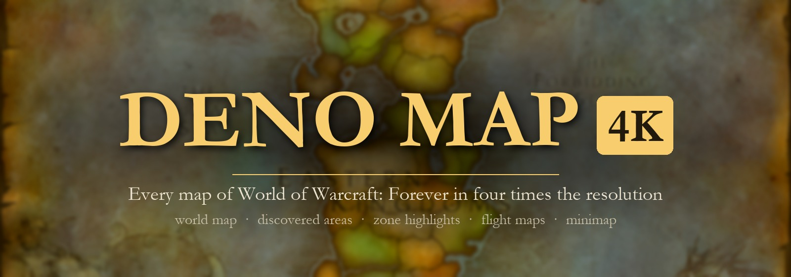

  
  
  
  

<h3 align="center">The world map and the minimap of World of Warcraft: Forever, sharp on a modern screen.</h3>

  One addon. Every zone, city, continent and battleground map at <b>4008 x 2672</b> instead of 1002 x 668, 
  the minimap terrain at <b>four times</b> its resolution, deeper zoom, and nothing to set up.

---

## Before and after

Every picture below is cut from the game's own texture (left) and from this addon's (right), at the same spot.

<table>
  <tr>
    <td width="50%">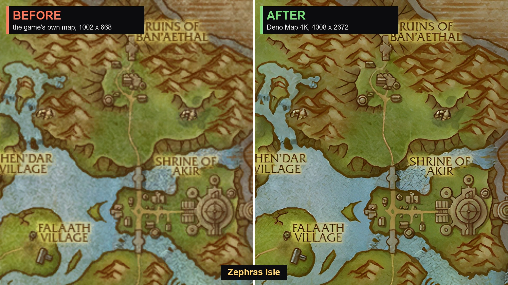
<b>Zephras Isle</b> - new in Forever
</td>
    <td width="50%">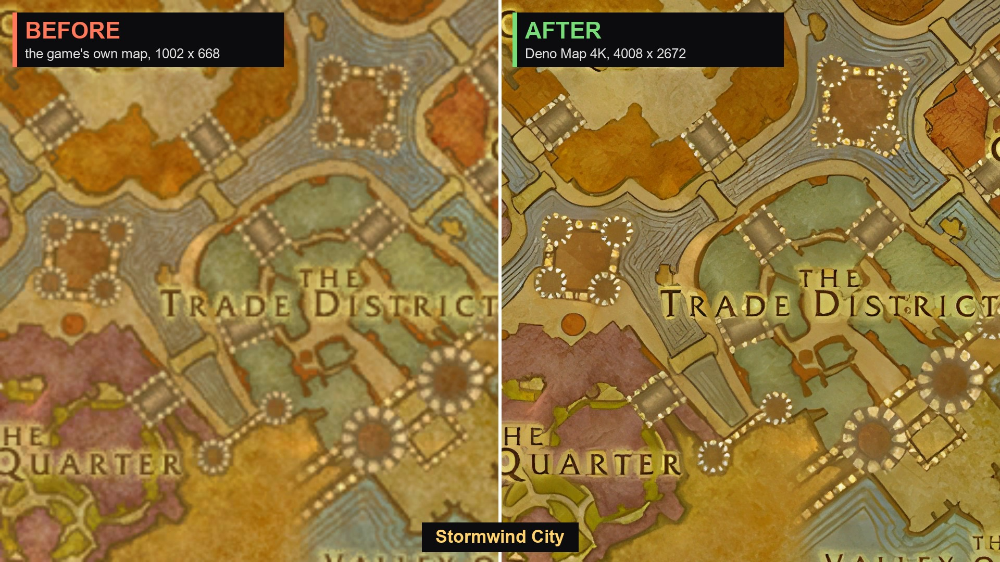
<b>Stormwind City</b>
</td>
  </tr>
  <tr>
    <td>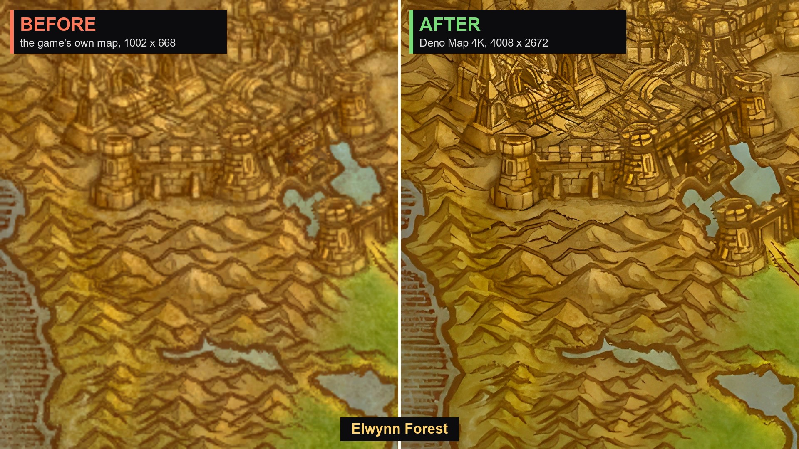
<b>Elwynn Forest</b>
</td>
    <td>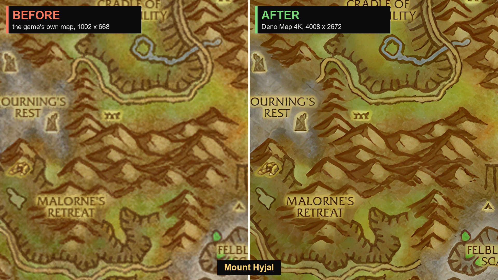
<b>Mount Hyjal</b> - new in Forever
</td>
  </tr>
  <tr>
    <td>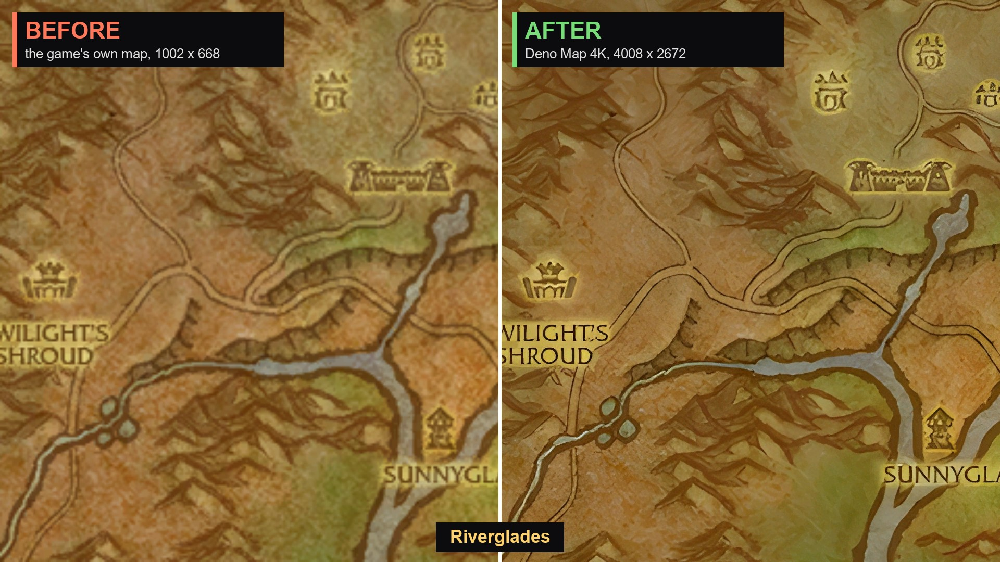
<b>Riverglades</b> - new in Forever
</td>
    <td>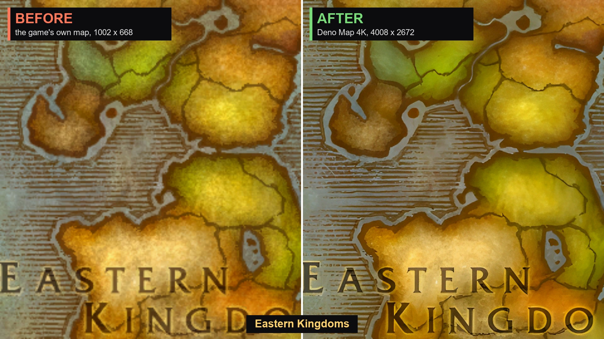
<b>Eastern Kingdoms</b>
</td>
  </tr>
  <tr>
    <td>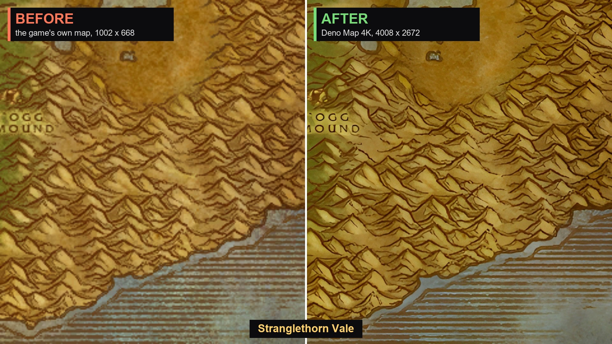
<b>Stranglethorn Vale</b>
</td>
    <td>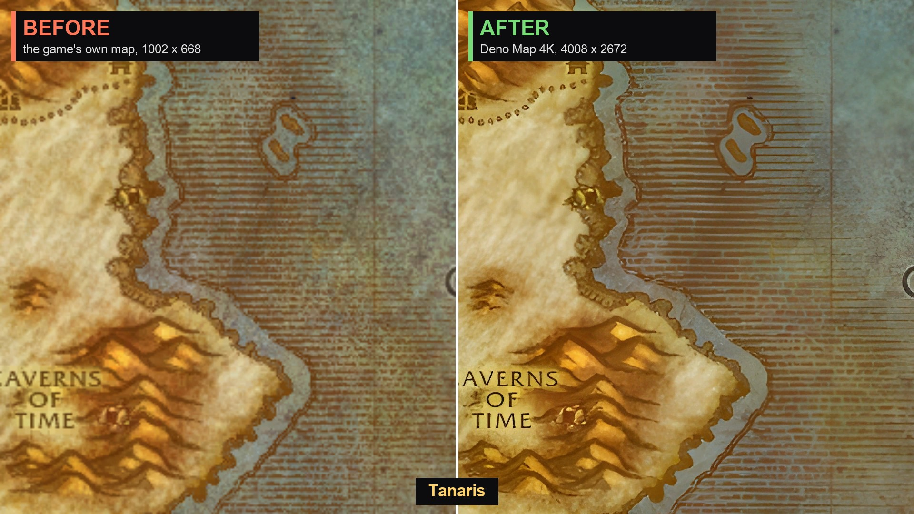
<b>Tanaris</b>
</td>
  </tr>
</table>

### The minimap

<table>
  <tr>
    <td width="50%">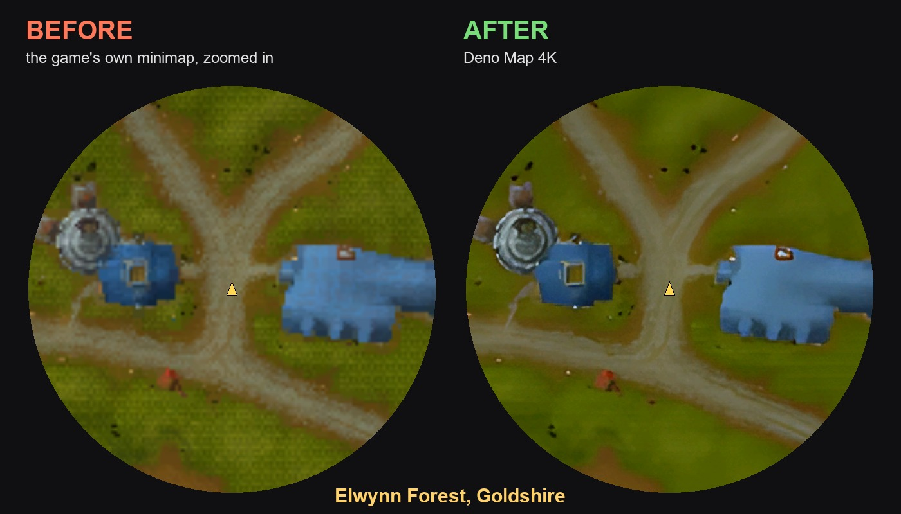</td>
    <td width="50%">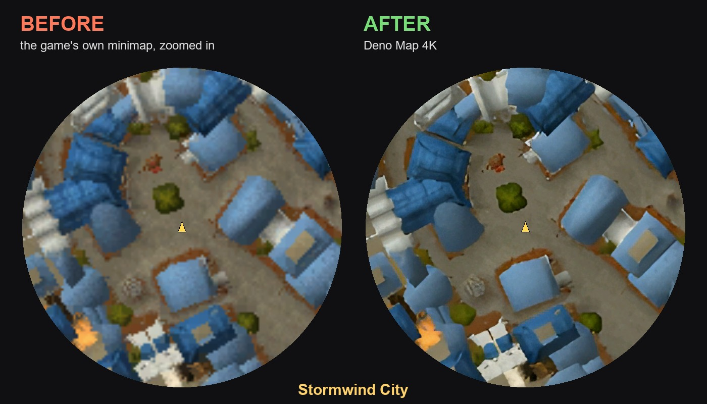</td>
  </tr>
</table>

### A whole map

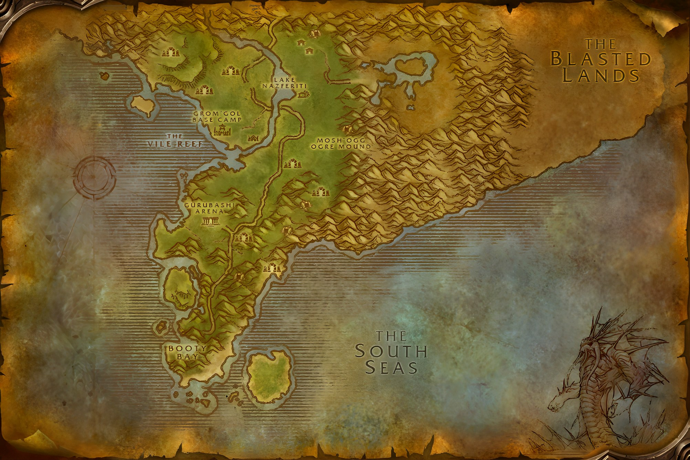

## What you get

| | |
|---|---|
| **World map in 4K** | All 57 maps of the game: every zone, city, continent and the three battlegrounds, at four times the resolution. |
| **Forever's own art** | Forever redrew every zone map and added new zones (Mount Hyjal, Zephras Isle, Riverglades, Shen'dralas, Darkspear Islands). Everything here is made from that art, so no map shows an older version of a zone. |
| **Discovered areas** | The coloured pieces that appear as you explore, 573 of them, upscaled the same way. They line up with the map underneath. |
| **Zone highlights and flight maps** | The glow over a zone on a continent map, and the flight master's maps. |
| **Minimap in 4K** | Outdoors the minimap terrain is drawn from 1,888 tiles at four times the resolution: Eastern Kingdoms, Kalimdor, Zephras Isle, the battlegrounds and Darkspear Islands. It follows you, zooms with the minimap and turns with the rotating minimap. Dots, arrows and tracking stay the game's own. |
| **Zoom further** | The mouse wheel zooms the world map up to five times its size (the game stops at about two). Hold the left button and drag to move around while zoomed in. |
| **Safe by design** | Nothing of the game's is replaced, only hooked. A map or tile the addon does not have keeps the game's own art, so nothing can go blank. |
| **No setup** | No settings, no libraries, no dependencies. Install it and open the map. |

## Install

The addon is large (about 5 GB, 3,592 textures), so it lives in this repository as a whole instead of in a release file.

1. Press **Code > Download ZIP** at the top of this page (or take **Source code (zip)** from the [latest release](https://github.com/DenoHearth/DenoMap/releases/latest)).
2. Open the zip. Inside the top folder is a folder named **`DenoMap`**.
3. Move that `DenoMap` folder into `World of Warcraft\<Forever folder>\Interface\AddOns\`.
4. Restart the game.

With git: `git clone --depth 1 https://github.com/DenoHearth/DenoMap.git`, then copy the inner `DenoMap` folder.

To save space you can delete `DenoMap\Minimap`: the world map keeps working and the minimap shows the game's own terrain.

## Commands

| Command | What it does |
|---|---|
| `/denomap` | How many textures of the map you last opened are shown in 4K, and what the minimap is doing |
| `/denomap minimap` | Switch the 4K minimap on or off |
| `/denomap selftest` | Write what the addon measured to its saved variables and take two screenshots, for looking into a problem |

## Good to know

- **Indoors and in dungeons the minimap is the game's own.** Inside buildings and caves the game shows floor plans that an addon cannot place, and dungeons give addons no position.
- **An upscale sharpens, it does not invent.** Lines and lettering get crisp; detail the artists never painted is not added. The minimap gains most when it is zoomed in.
- **New in the game, new here.** Version 1.2.0 was made from game build 1.60.1.70235. When a patch changes a map, its textures have to be made again (see below).

## How it works

The game sets every map tile, discovered area, zone highlight and flight map by file id. `DenoMap\Maps` holds a 4x upscale of each of those files under the same id; after the game has drawn a map, each texture that has an upscale is pointed at it.

The minimap terrain is drawn by the game itself and cannot be replaced, but the game can be asked not to draw it while it keeps drawing dots and arrows. That is how Blizzard's own "hybrid minimap" works, and this addon does the same: it switches the terrain off and shows its own tiles underneath, placed from your position.

<b>Files</b>

| File | Purpose |
|---|---|
| `DenoMap\Core.lua` | The hooks and the texture swap for world map, discovered areas, highlights and flight maps |
| `DenoMap\Zoom.lua` | The extra zoom steps |
| `DenoMap\Minimap.lua` | The 4K minimap |
| `DenoMap\SelfTest.lua` | The self test |
| `DenoMap\Manifest.lua` | Generated: the file ids that have an upscale |
| `DenoMap\Maps\` | World map textures, named by file id |
| `DenoMap\Minimap\<world map id>\` | Minimap tiles, with their list `Tiles.lua` |
| `DenoMap\tools\` | The scripts that made the textures |

<b>How the textures are made</b>

`DenoMap\tools` holds the whole pipeline (Python, an NVIDIA GPU, the RealESRGAN x4plus model):

- `jobs.py` reads the game's map tables for a build and downloads the source textures.
- `process.py` stitches each map and each discovered area into one picture, upscales it 4x, cuts it back into tiles and writes them as DXT-compressed BLP files. Stitching first is what keeps the tiles free of seams.
- `extras.py` does the flight maps and zone highlights; `manifest.py` writes the list of file ids.
- `mjobs.py` reads each world's terrain index for its minimap tiles, `mprocess.py` upscales them with a rim of their neighbours, `mtiles.py` writes the tile lists.

Steps are in [`DenoMap/tools/README.md`](DenoMap/tools/README.md).

## Credits and licence

- Map art belongs to **Blizzard Entertainment**. This addon ships upscaled copies of it for use in their game; the MIT licence in this repository covers the code and scripts, not the art.
- Upscaling model: [Real-ESRGAN](https://github.com/xinntao/Real-ESRGAN) by Xintao Wang and others.
- Made by Deniz. Changes per version: [CHANGELOG.md](CHANGELOG.md).

Keywords: World of Warcraft Forever addon, WoW Forever, Classic Plus, 4K world map, HD world map, high resolution map, HD minimap, 4K minimap, upscaled map textures, map zoom, texture pack.
